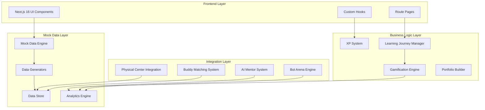

# Design Document - PUSULA Platform Enhancement

## Overview

The PUSULA Platform Enhancement transforms the existing 35% complete digital youth center platform into a production-ready demonstration system for UNDP stakeholders. The design focuses on creating a comprehensive mock data ecosystem that showcases the full learner journey from apprentice (Çırak) to graduate (Mezun), while maintaining the existing Next.js 16 + TypeScript architecture.

The enhancement eliminates all Supabase dependencies, replacing them with sophisticated mock data systems that demonstrate real-world impact metrics, social outcomes, and innovative learning methodologies aligned with UN Sustainable Development Goals.

## Architecture

### System Architecture



### Data Flow Architecture

The platform operates on a sophisticated mock data system that simulates real user interactions, progress tracking, and social impact metrics:

1. **Mock Data Engine**: Central system generating realistic user data, progress metrics, and interaction patterns
2. **Learning Journey Manager**: Orchestrates the progression through learning phases with appropriate content and challenges
3. **Analytics Engine**: Produces UNDP-focused metrics demonstrating social impact and learning outcomes
4. **Gamification Engine**: Manages XP, badges, leaderboards, and achievement systems

## Components and Interfaces

### Core Components

#### Mock Data Engine
```typescript
interface MockDataEngine {
  generateUserProfiles(count: number): DemoUser[]
  generateLearningProgress(userId: string): LearningProgress
  generateSocialImpactMetrics(): SDGMetrics
  generateCohortData(sdgFocus: number): CohortData
  simulateRealTimeActivity(): ActivityStream
}
```

#### Learning Journey Manager
```typescript
interface LearningJourneyManager {
  initializeJourney(user: DemoUser): LearningPath
  progressToNextPhase(userId: string): PhaseTransition
  calculateCompletionRequirements(level: Level): Requirements
  generatePersonalizedContent(user: DemoUser): ContentRecommendations
}
```

#### Enhanced Gamification System
```typescript
interface GamificationEngine {
  calculateXP(activity: Activity): number
  awardBadges(user: DemoUser, achievement: Achievement): Badge[]
  updateLeaderboard(users: DemoUser[]): LeaderboardEntry[]
  generateChallenges(level: Level): Challenge[]
  trackStreaks(userId: string): StreakData
}
```

#### Physical Center Integration
```typescript
interface PhysicalCenterIntegration {
  simulateCheckIn(userId: string): CheckInResult
  getCapacityStatus(): CenterCapacity
  generateAttendanceMetrics(): AttendanceReport
  applyLocationBonus(activity: Activity): number
  scheduleEvents(): Event[]
}
```

### Enhanced UI Components

#### Dashboard Enhancement
- **Next Best Action Card**: Eliminates decision fatigue by clearly showing the next recommended step
- **Progress Visualization**: Interactive progress tracking with milestone celebrations
- **Social Feed**: Real-time activity stream showing peer achievements and community updates
- **Impact Metrics**: SDG-aligned progress indicators showing social impact contributions

#### Learning Module Player
- **Interactive Simulations**: 36+ hands-on learning experiences with immediate feedback
- **Adaptive Difficulty**: Content that adjusts based on learner performance and preferences
- **Collaborative Features**: Peer learning integration within modules
- **Evidence Collection**: Automatic portfolio building during learning activities

#### Bot Arena System
- **Competition Engine**: Multiple bot battle formats (trading, scraping, chatbots, CSS battles)
- **Real-time Leaderboards**: Live competition tracking with spectator modes
- **Performance Analytics**: Detailed analysis of bot performance and strategy effectiveness
- **Tournament Management**: Automated tournament brackets and scheduling

## Data Models

### Enhanced User Profile
```typescript
interface EnhancedDemoUser extends DemoUser {
  // Existing fields plus:
  physicalCenterVisits: number
  preferredLearningStyle: 'visual' | 'auditory' | 'kinesthetic' | 'mixed'
  sdgContributions: SDGContribution[]
  mentorshipGiven: number
  mentorshipReceived: number
  portfolioItems: PortfolioItem[]
  careerInterests: string[]
  realWorldProjects: Project[]
  networkConnections: Connection[]
}
```

### Learning Content Structure
```typescript
interface MicroLabContent {
  id: string
  title: string
  phase: 'kesif' | 'insa' | 'etki'
  sdgAlignment: number[]
  estimatedMinutes: number
  interactiveElements: InteractiveElement[]
  prerequisites: string[]
  learningObjectives: string[]
  assessmentCriteria: AssessmentCriteria
  realWorldApplication: string
}

interface Challenge {
  id: string
  title: string
  description: string
  difficulty: 'easy' | 'med' | 'hard'
  sdgImpact: SDGImpact
  deliverables: Deliverable[]
  evaluationRubric: Rubric
  timeEstimate: number
  collaborationLevel: 'individual' | 'pair' | 'team'
  realWorldContext: string
}
```

### Analytics and Metrics
```typescript
interface UNDPMetrics {
  totalLearners: number
  completionRate: number
  skillsAcquired: SkillMetric[]
  sdgContributions: SDGContribution[]
  employmentOutcomes: EmploymentData
  communityImpact: CommunityImpact
  digitalInclusionMetrics: InclusionMetrics
  genderEquityData: GenderData
  sustainabilityProjects: Project[]
}
```

### Physical-Digital Integration
```typescript
interface CenterIntegration {
  dailyCapacity: number
  currentOccupancy: number
  equipmentStatus: EquipmentStatus[]
  scheduledEvents: Event[]
  attendancePatterns: AttendancePattern[]
  collaborationSpaces: Space[]
  resourceUtilization: ResourceMetrics
}
```

## Correctness Properties

*A property is a characteristic or behavior that should hold true across all valid executions of a system—essentially, a formal statement about what the system should do. Properties serve as the bridge between human-readable specifications and machine-verifiable correctness guarantees.*

Based on the prework analysis, the following properties ensure system correctness:

### Property 1: Mock Data Generation Completeness
*For any* system initialization, the Mock Data Engine should generate at least 100 diverse user profiles with realistic timestamps, completion rates, and engagement metrics that demonstrate successful learning outcomes and social impact.
**Validates: Requirements 1.1, 1.3, 1.4, 1.5**

### Property 2: Data Authenticity Consistency  
*For any* feature request for data, the system should serve mock data that appears authentic, comprehensive, and maintains consistency across all platform features.
**Validates: Requirements 1.2**

### Property 3: Content Availability Requirements
*For any* content access request, the system should provide at least 50 MicroLab modules and 40 Challenge assignments, properly organized by learning phases with SDG alignment.
**Validates: Requirements 2.1, 2.2, 2.3, 2.4**

### Property 4: XP System Consistency
*For any* completed activity, the XP system should award experience points proportional to difficulty and quality, correctly implement level thresholds (Çırak: 0, Kalfa: 1000, Usta: 2500, Mezun: 5000), and unlock appropriate features at each level.
**Validates: Requirements 2.5, 3.1, 3.2, 3.5**

### Property 5: Achievement and Recognition System
*For any* milestone achievement, the system should award appropriate digital badges and certificates, and maintain accurate real-time leaderboards across different performance metrics.
**Validates: Requirements 3.3, 3.4**

### Property 6: AI Mentor Response Quality
*For any* learner question, the AI Mentor should provide contextual, educational responses within 5 seconds, maintain conversation history, reference relevant materials, and track engagement metrics.
**Validates: Requirements 4.1, 4.2, 4.3, 4.5**

### Property 7: AI Mentor Escalation Logic
*For any* complex question that meets escalation criteria, the AI Mentor should properly escalate to human guides when appropriate.
**Validates: Requirements 4.4**

### Property 8: Buddy System Matching and Collaboration
*For any* learner joining a cohort, the Buddy System should match them with compatible peers, facilitate structured learning activities, provide communication tools, and award collaboration XP for peer learning sessions.
**Validates: Requirements 5.1, 5.2, 5.3, 5.5**

### Property 9: Buddy System Adaptive Learning
*For any* peer learning interaction, the system should track outcomes and adjust matching algorithms based on learning effectiveness data.
**Validates: Requirements 5.4**

### Property 10: Portfolio Automation and Quality
*For any* completed project, the Portfolio Engine should automatically collect evidence, support multiple media types, present professional-quality showcases, and generate exportable formats.
**Validates: Requirements 6.1, 6.2, 6.3, 6.4**

### Property 11: Graduation Certification
*For any* learner graduation, the system should provide verified digital certificates properly linked to portfolio achievements.
**Validates: Requirements 6.5**

### Property 12: Physical Center Integration
*For any* physical center interaction, the system should support QR check-in, provide real-time capacity information, apply location-based XP bonuses (50% multiplier), and integrate event schedules with learning plans.
**Validates: Requirements 7.1, 7.2, 7.3, 7.5**

### Property 13: Resource Management
*For any* equipment or workspace request, the Physical Integration system should properly manage reservations and assignments.
**Validates: Requirements 7.4**

### Property 14: Bot Arena Competition System
*For any* bot competition, the Arena should provide multiple formats, automatically evaluate and rank submissions, support real-time leaderboards with spectator modes, and archive results with performance analytics.
**Validates: Requirements 8.1, 8.2, 8.3, 8.5**

### Property 15: Competition Recognition System
*For any* concluded competition, the system should award special achievements and recognition to winners.
**Validates: Requirements 8.4**

### Property 16: Comprehensive Analytics Tracking
*For any* learning activity, the system should track detailed analytics including time spent, completion rates, and skill development, providing actionable insights and real-time KPI dashboards.
**Validates: Requirements 9.1, 9.2, 9.5**

### Property 17: Predictive Analytics and Reporting
*For any* at-risk learning pattern, the system should generate early warning alerts, and for stakeholder requests, produce comprehensive SDG-aligned impact metrics.
**Validates: Requirements 9.3, 9.4**

### Property 18: Interactive Simulation System
*For any* simulation engagement, the system should provide immediate feedback, support collaborative exercises, assess performance with improvement suggestions, and integrate results with progress tracking and portfolio development.
**Validates: Requirements 10.1, 10.2, 10.3, 10.4, 10.5**

### Property 19: Mobile and Offline Functionality
*For any* mobile device usage, the system should provide responsive interfaces for core activities, support offline content consumption with progress tracking, and synchronize offline activities when connectivity is restored.
**Validates: Requirements 11.1, 11.2, 11.3, 11.4**

### Property 20: Adaptive Content Delivery
*For any* network or device condition, the system should optimize content delivery based on varying capabilities and constraints.
**Validates: Requirements 11.5**

### Property 21: Security and Access Control
*For any* access attempt, the system should implement comprehensive route protection, encrypt sensitive data with audit logs, and implement rate limiting on API endpoints.
**Validates: Requirements 12.1, 12.2, 12.3**

### Property 22: Security Incident Response
*For any* security incident, the system should provide immediate alerts and automated response measures.
**Validates: Requirements 12.4**

### Property 23: Regulatory Compliance
*For any* user data handling operation, the system should comply with GDPR and Turkish data protection regulations.
**Validates: Requirements 12.5**

<function_calls>
<invoke name="prework">
<parameter name="featureName">pusula-platform-enhancement

## Error Handling

### Mock Data System Error Handling
- **Data Generation Failures**: Graceful fallback to minimal viable datasets when generation fails
- **Data Consistency Errors**: Automatic data validation and repair mechanisms
- **Performance Degradation**: Lazy loading and caching strategies for large datasets

### Learning System Error Handling
- **Progress Tracking Failures**: Local storage backup with sync recovery
- **XP Calculation Errors**: Audit trail and manual correction capabilities
- **Content Loading Failures**: Offline content caching and progressive loading

### Integration Error Handling
- **AI Mentor Failures**: Fallback to predefined helpful responses and escalation to human guides
- **Physical Center Integration**: Graceful degradation when physical systems are unavailable
- **Bot Arena Failures**: Competition state preservation and automatic recovery

### Security Error Handling
- **Authentication Failures**: Clear error messages with recovery guidance
- **Authorization Violations**: Secure logging and automatic session management
- **Data Protection Violations**: Immediate containment and compliance reporting

## Testing Strategy

### Dual Testing Approach

The PUSULA platform enhancement requires both unit testing and property-based testing to ensure comprehensive coverage and correctness validation.

**Unit Testing Focus:**
- Specific mock data generation scenarios and edge cases
- Individual component functionality and integration points
- Error conditions and recovery mechanisms
- UI component rendering and interaction behaviors
- Security boundary conditions and access control scenarios

**Property-Based Testing Focus:**
- Universal properties that hold across all generated data sets
- Comprehensive input coverage through randomization for learning algorithms
- XP system consistency across all activity types and difficulty levels
- Portfolio and analytics system correctness across diverse user journeys
- Security and compliance properties across all data handling operations

### Property-Based Testing Configuration

**Testing Library**: Fast-check for TypeScript/JavaScript property-based testing
**Test Configuration**: Minimum 100 iterations per property test to ensure statistical confidence
**Test Tagging**: Each property test must reference its corresponding design document property

**Example Test Tags:**
- **Feature: pusula-platform-enhancement, Property 1**: Mock Data Generation Completeness
- **Feature: pusula-platform-enhancement, Property 4**: XP System Consistency
- **Feature: pusula-platform-enhancement, Property 16**: Comprehensive Analytics Tracking

### Testing Priorities

1. **Critical Path Testing**: Mock data generation, XP system, and learning journey progression
2. **Integration Testing**: Physical center integration, AI mentor system, and buddy matching
3. **Performance Testing**: Large dataset handling, real-time updates, and mobile responsiveness
4. **Security Testing**: Route protection, data encryption, and compliance validation
5. **User Experience Testing**: Dashboard functionality, navigation flows, and accessibility

### UNDP Demo Validation

**Stakeholder-Focused Testing:**
- Social impact metrics accuracy and presentation
- SDG alignment validation across all content
- Learning outcome demonstration scenarios
- Employment readiness and skill development tracking
- Community impact and digital inclusion metrics

**Demo Scenario Testing:**
- Complete learner journey from onboarding to graduation
- Multi-cohort management and progress tracking
- Physical-digital integration demonstrations
- Real-time analytics and reporting capabilities
- Scalability and sustainability metrics presentation

The testing strategy ensures that the enhanced PUSULA platform not only functions correctly but also effectively demonstrates its potential impact to UNDP stakeholders through reliable, comprehensive, and impressive mock data scenarios.